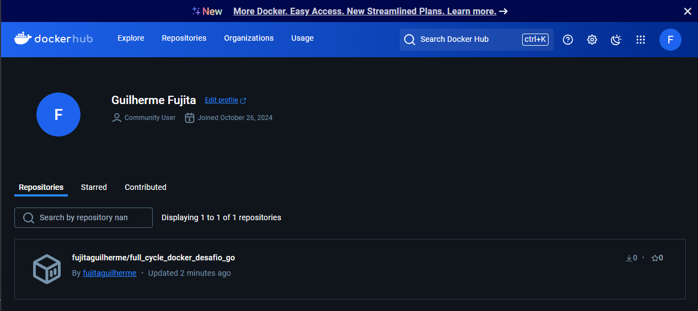

Este repositório refere-se ao desafio de Golang do curso de Full Cycle, módulo de Docker

O link para download da imagem docker no Dockerhub encontra-se abaixo.
```bash
docker pull fujitaguilherme/full_cycle_docker_desafio_go
```


